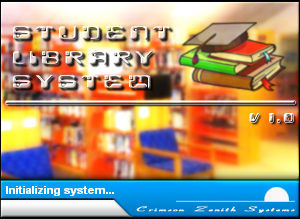



## \_A Student Library System\_

### Description

This project demonstrates database manipulation through ADO. It is a complete application in itself. Thanks and credit goes to LaVolpe for his magnificent buttons that I used in the project. This is my first submission to this great site and I hope you could learn something from it. Please give your comments and suggestions so that I could improve it and hopefully upload a version 2 of this project. If its not too much to ask, PLEASE do vote so that I'd know where my learning status stands. Thanks and God bless.

***NOTE For those of you who downloaded the code from March 19 - 20, 2004: Please redownload the code. I reuploaded it fixing the bugs during initialization. Thanks and God Bless.
 
### More Info
 
Database Password is "crimson119".

             |
---                |---
**Submitted On**   |2004-03-19 22:39:14
**By**             |[Francis Arnold G\. Balatico](https://github.com/Planet-Source-Code/PSCIndex/blob/master/ByAuthor/francis-arnold-g-balatico.md)
**Level**          |Intermediate
**User Rating**    |4.7 (302 globes from 64 users)
**Compatibility**  |VB 6\.0
**Category**       |[Complete Applications](https://github.com/Planet-Source-Code/PSCIndex/blob/master/ByCategory/complete-applications__1-27.md)
**World**          |[Visual Basic](https://github.com/Planet-Source-Code/PSCIndex/blob/master/ByWorld/visual-basic.md)
**Archive File**   |[\_A\_Student1723083212004\.zip](https://github.com/Planet-Source-Code/francis-arnold-g-balatico-a-student-library-system__1-52478/archive/master.zip)

